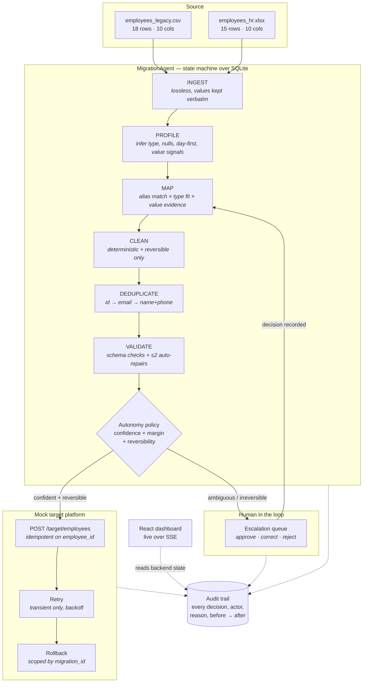

# Darwinbox FDE — AI Data Migration Agent

An AI agent that migrates messy employee data from legacy HR/CRM exports into a
new platform. It maps, cleans, de-duplicates and validates on its own — and
stops only where a wrong answer would be expensive.

> **Runs with zero configuration.** No API key, no network, no LLM required.
> `LLM_PROVIDER=none` (the default) is a fully functional deterministic mode.

---

## Problem

A client is moving off a legacy HR system. Their export is two files that
disagree with each other:

- different column names (`Emp ID` vs `employee_code`, `DOB` vs `birth_date`)
- different date formats (`12/08/1988`, `1988-08-12`, `12-Aug-2019`)
- stray whitespace and `SHOUTING@EMAIL.COM`
- the same employee in both files, sometimes with conflicting values
- duplicate rows inside each file
- a mandatory field missing entirely
- a column (`Contact No`) that could legitimately mean two different things

A human doing this by hand takes days and makes silent mistakes. A naive script
takes seconds and makes *confident* silent mistakes.

## Solution

An agent that is **autonomous by default** and escalates only genuine
uncertainty. Every decision carries a confidence score and a written reason;
every transformation is recorded with its before/after value; every write to
the target is reversible.

On the bundled demo data the agent makes **~310 decisions on its own** and asks
a human **3 questions**.

---

## Architecture



### Separation of concerns

| Layer | Module | Responsibility |
|---|---|---|
| Ingestion | `services/ingestion.py` | CSV/XLSX → rows, lossless |
| Profiling | `services/schema_inference.py` | per-column type, stats, value signals |
| Agent reasoning | `services/mapping_agent.py` | confidence scoring + autonomy decision |
| Transformation | `services/cleaning.py` | deterministic, reversible normalisation |
| Reconciliation | `services/deduplication.py` | matching + field-level merge policy |
| Validation | `services/validation.py` | schema checks + bounded auto-repair |
| Human escalation | `services/escalation.py` | create / resolve, HITL boundary |
| Orchestration | `services/migration_agent.py` | the state machine |
| Target integration | `services/target_api.py`, `retry.py`, `rollback.py` | push, retry, undo |
| Audit | `services/audit.py` | every decision, agent or human |

---

## Agent Decision Model

Autonomy is decided by **confidence × margin × reversibility × criticality** —
never by confidence alone.

| Band | Rule |
|---|---|
| **High** — ≥ 0.90 | Apply automatically, **provided** no runner-up is within 0.10. A tie at high confidence is still a tie. |
| **Medium** — 0.70–0.89 | Apply only if *all* hold: margin over runner-up ≥ 0.15, the target field is not mandatory, the inferred type fits. Otherwise escalate. |
| **Low** — < 0.70 | Always escalate. |
| **No match** — name similarity < 0.72 | Leave unmapped. Not an escalation — the column simply has no home (`Remarks`, `location`). |

**Why the margin matters.** `Contact No` scores:

```
mobile_phone   74%   ← "contact no" is a valid alias, values look like mobiles
work_phone     70%   ← "contact no" is an equally valid alias
```

The agent is confident it is *a phone field* and uncertain *which one*. A single
score hides that. The 4-point margin exposes it, and the agent stops.

The score itself is built from four explainable signals:

1. **Name similarity** against the target field's alias vocabulary.
2. **Type compatibility** — inferred column type vs declared target type.
3. **Value evidence** — "these are 10-digit numbers starting 6–9".
4. **Discriminative damping** — an alias claimed by several target fields
   carries less information, so scores derived from it are damped. This is what
   turns a false 0.98 into an honest 0.74.

---

## Escalation Boundary

### The agent escalates — and only for these reasons

| # | Trigger | Example from the demo |
|---|---|---|
| 1 | Two targets within the confidence margin | `Contact No` → `mobile_phone` 74% vs `work_phone` 70% |
| 2 | A mandatory field cannot be resolved | `EMP1042` has no email in *either* file |
| 3 | A value cannot be cleaned without guessing | status value outside the declared enum |
| 4 | Still invalid after 2 automatic repairs | repair budget exhausted |
| 5 | Duplicates conflict on a **critical** field | `EMP1017` is `Active` in legacy, `resigned` in HR |
| 6 | A destructive action | rollback always needs a human |

### The agent does NOT escalate

Whitespace, casing, email normalisation, deterministic date conversion, obvious
duplicate rows, high-confidence mappings, non-critical merge conflicts, or
retryable API failures. Those are handled and recorded.

### Two cases that look the same and are not

| | `EMP1042` — missing email | `EMP1004` — DOB `31/02/1990` |
|---|---|---|
| Can the agent fix it? | No — only guess | No — the date does not exist |
| Is the field mandatory? | **Yes** | No |
| Is a wrong value reversible? | **No** (welcome mail goes out) | n/a |
| **Outcome** | **Escalate** | **Drop the value, audit it, continue** |

Same uncertainty, different consequence, different answer. That is the whole
design in one table.

---

## Human-in-the-Loop

Each escalation card shows, in one glance:

- the source field, file and sample values
- **every** candidate the agent considered, with score and reasoning
- **why the agent stopped**, in plain English
- four actions: pick a candidate · enter a custom value · reject · add an
  audit note

```
⚠ REVIEW REQUIRED                                    HIGH

Ambiguous field mapping
Source field: Contact No  (in employees_legacy.csv)
Samples: +91 98765 43210 · 9876543211 · +919876543212

WHY THE AGENT STOPPED
'Contact No' could reasonably map to mobile_phone (74%) or
work_phone (70%). The gap (4%) is below the 15% margin
required to decide alone.

→ mobile_phone   ▬▬▬▬▬▬▭▭▭ 74%
→ work_phone     ▬▬▬▬▬▬▭▭▭ 70%
✎ Enter a custom value                        ⃠ Reject
```

Resolving the **last** blocking escalation resumes the agent automatically: the
decision is written back onto the mapping, the transform pipeline re-runs, the
affected records are re-validated, and the push starts. No second round of
clicks.

Rejecting excludes just that column or record — everything else continues.

---

## Data Pipeline

| Stage | What happens | Autonomy |
|---|---|---|
| **Ingestion** | CSV/XLSX read as raw strings; nothing cleaned | full |
| **Profiling** | Per column: semantic type, null ratio, uniqueness, day-first, value signals | full |
| **Mapping** | Score every source column against every target field; enforce one column per target | full above thresholds |
| **Cleaning** | Trim, case, email, phone → E.164, dates → ISO-8601, enums | full, every change recorded |
| **Deduplication** | Match on `employee_id` → normalised email → name+phone. Identical merges silently; blanks fill; non-critical conflicts resolve by source precedence | full except critical conflicts |
| **Validation** | Schema checks; ≤ 2 automatic repair attempts | full within the repair budget |
| **HITL** | Blocking escalations; agent waits | human |
| **Target API** | Idempotent push, per-record status | full |
| **Retry** | Transient only, exponential backoff, max 3 attempts | full |
| **Rollback** | Deletes exactly this migration's records | human-triggered |

---

## Tech Stack

**Backend** — Python 3.11+, FastAPI, Pydantic v2, SQLAlchemy 2, SQLite,
pandas, openpyxl, Uvicorn, pytest
**Frontend** — React 18, Vite 6, TypeScript, Tailwind CSS, lucide-react
**Live updates** — Server-Sent Events
**AI (optional)** — Ollama by default, or any OpenAI-compatible endpoint

---

## Project Structure

```
darwinbox-fde-agent/
├── backend/
│   ├── app/
│   │   ├── main.py                  FastAPI app, error handlers, lifespan
│   │   ├── config.py                env-driven settings (autonomy thresholds live here)
│   │   ├── database.py              engine, session, init/reset
│   │   ├── models/                  SQLAlchemy entities + enums
│   │   ├── schemas/                 Pydantic request/response DTOs
│   │   ├── api/                     migrations · escalations · target · system
│   │   ├── services/
│   │   │   ├── ingestion.py         CSV / XLSX → rows
│   │   │   ├── schema_inference.py  column profiling
│   │   │   ├── mapping_agent.py     confidence scoring + autonomy policy
│   │   │   ├── cleaning.py          deterministic normalisation
│   │   │   ├── deduplication.py     matching + merge policy
│   │   │   ├── validation.py        schema checks + bounded repair
│   │   │   ├── escalation.py        HITL create / resolve
│   │   │   ├── migration_agent.py   the orchestrator
│   │   │   ├── target_api.py        mock target platform
│   │   │   ├── retry.py             backoff, transient vs permanent
│   │   │   ├── rollback.py          scoped undo
│   │   │   ├── audit.py             the audit trail
│   │   │   ├── events.py            SSE pub/sub
│   │   │   └── llm.py               optional advisory LLM
│   │   └── utils/                   text · dates · logging · errors
│   ├── tests/                       units · target API · end-to-end
│   ├── seed_demo.py                 regenerates the messy source files
│   └── requirements.txt
├── frontend/
│   └── src/
│       ├── App.tsx                  shell, nav, migration controls
│       ├── pages/                   Overview · AgentActivity · Escalations ·
│       │                            Mappings · DataPreview · TargetPush · AuditTrail
│       ├── components/              EscalationCard · ConfirmDialog · primitives
│       ├── hooks/                   useMigration (SSE + poll) · useToast
│       ├── services/api.ts          typed API client
│       └── types/
├── data/
│   ├── employees_legacy.csv         messy source #1
│   ├── employees_hr.xlsx            messy source #2
│   └── target_schema.json           the target contract
├── demo/DEMO_SCRIPT.md              3–5 minute walkthrough
├── docs/approach.md                 the one-page write-up
├── Dockerfile                       multi-stage: builds the UI, serves both
├── render.yaml                      one-click deploy blueprint
├── docker-compose.yml
└── .env.example
```

---

## Local Setup

Requires **Python 3.11+** and **Node 18+**.

### 1. Backend

```bash
cd backend
python -m venv .venv
```

```bash
source .venv/bin/activate     # Windows: .venv\Scripts\activate
```

```bash
pip install -r requirements.txt
```

```bash
python seed_demo.py
```

`seed_demo.py` regenerates the two messy source files and prints the full list
of intentional defects — useful as ground truth when reviewing the agent.

### 2. Frontend

```bash
cd frontend && npm install
```

---

## Environment Variables

**All optional.** With no `.env` the app runs in DEMO MODE. Copy
`.env.example` to `.env` only if you want to change something.

| Variable | Default | Purpose |
|---|---|---|
| `LLM_PROVIDER` | `none` | `none` \| `ollama` \| `openai`. `none` = deterministic demo mode |
| `LLM_MODEL` | `llama3.1:8b` | Model name |
| `LLM_BASE_URL` | `http://localhost:11434/v1` | OpenAI-compatible endpoint |
| `LLM_API_KEY` | *(empty)* | Never commit a real key |
| `HIGH_CONFIDENCE_THRESHOLD` | `0.90` | Auto-apply floor |
| `MEDIUM_CONFIDENCE_THRESHOLD` | `0.70` | Escalation floor |
| `MIN_CONFIDENCE_MARGIN` | `0.15` | Gap required over the runner-up |
| `MAX_AUTO_REPAIR_ATTEMPTS` | `2` | Repair budget before escalating |
| `MAX_PUSH_ATTEMPTS` | `3` | Retry budget for transient failures |
| `TARGET_TRANSIENT_PROFILE` | `EMP1009:2,EMP1022:3` | Deterministic failure simulation |
| `AGENT_STEP_DELAY_SECONDS` | `0.35` | Pacing so a human can watch; `0` in tests |
| `DATABASE_URL` | `sqlite:///./migration.db` | Persistence |
| `UPLOAD_MAX_BYTES` | `10485760` | Upload size cap |
| `ALLOWED_UPLOAD_EXTENSIONS` | `.csv,.xlsx,.xls` | Upload allow-list |

---

## Running

**Terminal 1 — backend** (from `backend/`, venv active):

```bash
uvicorn app.main:app --reload --port 8000
```

**Terminal 2 — frontend** (from `frontend/`):

```bash
npm run dev
```

Open **http://localhost:5173**.

API docs (Swagger): **http://localhost:8000/docs**

### Docker (single service, same image that is deployed)

```bash
docker compose up --build
```

Then open **http://localhost:8000** — FastAPI serves the API, the mock target
platform and the built React UI from one origin.

---

## Deployment

The repo ships a **multi-stage `Dockerfile`** (Node builds the UI → Python
serves everything) and a **`render.yaml`** blueprint, so the whole thing is one
public service with one URL.

### Render (free tier)

1. Push this repo to GitHub.
2. On [render.com](https://render.com): **New +** → **Blueprint** → connect the
   repo → **Apply**. Render reads `render.yaml`, builds the Docker image and
   deploys.
3. The service comes up at `https://<name>.onrender.com`. The dashboard, the
   Swagger docs at `/docs` and the mock target API are all on that one origin.

No environment variables to set — it runs in deterministic demo mode.

Two honest caveats for a reviewer:

- **Cold start.** The free tier sleeps after ~15 minutes idle; the first
  request then takes ~30 seconds.
- **Ephemeral disk.** The SQLite file is recreated on restart. The demo sources
  are regenerated on boot by `seed_demo.py`, so the app is always ready — but a
  migration run does not survive a restart. Attaching a Render disk (or
  pointing `DATABASE_URL` at Postgres) fixes that; it is out of scope here.

### Anywhere else

Any Docker host works:

```bash
docker build -t darwinbox-fde-agent . && docker run -p 8000:8000 darwinbox-fde-agent
```

The image binds `$PORT` (default 8000), which is what Render, Fly.io and Cloud
Run all expect.

---

## Demo

1. Open **http://localhost:5173** and click **Run demo migration**.
2. Watch the agent work — the pipeline advances through `PROFILING → MAPPING →
   CLEANING → DEDUPLICATING → VALIDATING` with live activity streaming in.
3. It halts at **`WAITING FOR HUMAN`** with **3 escalations**. Everything else
   — 17 mappings, ~112 cleaned values, 7 merged duplicates — is already done.
4. Open **Escalations**. Resolve all three:
   - `Contact No` → choose **`mobile_phone`**
   - `EMP1017` status → choose **`inactive`** (HR is the authoritative source)
   - `EMP1042` email → accept the suggestion or type your own
5. On the **third** decision the agent resumes **automatically**, re-validates
   and pushes. No extra clicks.
6. Open **Target push**:
   - `EMP1009` — `#1✕ #2✕ #3✓` recovered automatically from transient errors
   - `EMP1022` — failed all 3 attempts, marked **retryable**
   - `EMP1011` — rejected permanently (`Ops Excellence` is not in the target's
     department master data), marked **not retryable**
7. Click **Retry failed** → `EMP1022` succeeds on attempt `#4`. `EMP1011` stays
   failed, correctly.
8. Open **Audit trail**, filter actor = **Human** → exactly **3** events out of
   ~343. That is the autonomy story in one screen.
9. Click **Rollback**, confirm → all 25 records are removed from the target.

**Reset demo** (sidebar) wipes everything so you can replay it.

A full narrated walkthrough is in [`demo/DEMO_SCRIPT.md`](demo/DEMO_SCRIPT.md).

---

## API Documentation

Interactive Swagger UI at **http://localhost:8000/docs** (ReDoc at `/redoc`).

### Migrations
```
POST   /api/migrations                      create + auto-start (demo data)
POST   /api/migrations/upload               create from uploaded CSV/XLSX
GET    /api/migrations                      list
GET    /api/migrations/{id}                 detail + button enablement
POST   /api/migrations/{id}/start
POST   /api/migrations/{id}/pause
POST   /api/migrations/{id}/resume
POST   /api/migrations/{id}/push
POST   /api/migrations/{id}/retry           retryable failures only
POST   /api/migrations/{id}/rollback
```

### Read models
```
GET    /api/migrations/{id}/activity        Server-Sent Events stream
GET    /api/migrations/{id}/mappings
GET    /api/migrations/{id}/records?filter=all|cleaned|duplicates|escalated|invalid|ready|pushed|failed
GET    /api/migrations/{id}/escalations
GET    /api/migrations/{id}/audit?actor=&category=&q=
GET    /api/migrations/{id}/push-attempts
GET    /api/migrations/{id}/schema
```

### Human-in-the-loop
```
GET    /api/escalations/{id}
POST   /api/escalations/{id}/resolve        {decision, value, note, resolved_by}
POST   /api/escalations/{id}/reject
```

### Mock target platform
```
POST   /target/employees
POST   /target/employees/bulk
GET    /target/employees
DELETE /target/employees/{employee_id}
GET    /target/meta
```

### System
```
GET    /api/health                          mode, LLM status, autonomy thresholds
GET    /api/target-schema
POST   /api/demo/reset
```

---

## Testing

From `backend/` with the venv active:

```bash
pytest
```

51 tests. Targeted runs:

```bash
pytest tests/test_units.py -v
```

```bash
pytest tests/test_e2e.py -v
```

Coverage: CSV ingestion · Excel ingestion · field mapping · confidence
thresholds · date normalisation · duplicate detection and merge policy ·
validation and auto-repair · escalation creation · escalation resolution ·
rejection · target push · idempotency · retry · rollback scoping · audit-trail
actor separation · idempotent re-runs after a pause — plus one end-to-end test
that runs files → mapping → cleaning → escalation → human resolution →
re-validation → push → retry → rollback in a single scenario.

---

## AI Usage & Delta Solutioning

### Which model, and why it is optional

The only model integration is **open source and local-first**: Ollama
(`llama3.1:8b` by default) through an OpenAI-compatible interface, so any
self-hosted endpoint — vLLM, llama.cpp, Together, Groq — works by changing one
environment variable. There is no dependency on a paid proprietary API.

To run it LLM-assisted:

```bash
ollama pull llama3.1:8b && ollama serve
```

```bash
LLM_PROVIDER=ollama uvicorn app.main:app --port 8000
```

The sidebar then reads **LLM-assisted** instead of **Demo mode**. Any mapping
the model influenced carries a sparkle icon in the Field mappings view, shows
as `agent · AI` rather than `agent` in the activity feed, and is stored with
`ai_assisted = true` on the audit event — so AI-assisted decisions stay
visibly distinct from deterministic ones, which is the point.

**Why `none` is the default:** a reviewer should be able to clone and run this
with no downloads and see the same behaviour I saw. The deterministic path is
not a fallback stub — it is the real decision engine, and the LLM only nudges
it (see item 6 below). If the model is configured but unreachable, the agent
logs it and carries on rather than failing the migration.

### The delta

This was built with AI coding tools, as the brief invites. That makes the
interesting question *what was added on top of what a model produces by
default* — because a model asked for "a data migration agent" reliably
generates a plausible pipeline that silently guesses.

### The delta, in order of how much it changes behaviour

**1. Discriminative damping — the core idea.**
A generated mapper scores column names against target fields and takes the best
match. `contact no` is a legitimate alias of *both* `mobile_phone` and
`work_phone`, so it scores ~0.98 for whichever is checked first, and gets
silently auto-applied. The insight is that **an alias claimed by several target
fields carries less information**, so every score derived from it must be
damped:

```python
damping = 1 / (1 + 0.35 * (alias_claimants - 1))    # mapping_agent.py:176
```

That turns a false 0.98 into an honest 0.74 vs 0.70 — and turns an invisible
bug into the escalation this whole project exists to demonstrate.

**2. Margin as the autonomy gate, not confidence.**
Thresholds alone cannot distinguish "certain" from "certain it is one of these
two". Requiring a gap over the runner-up is what makes the policy defensible.

**3. Reversibility and criticality as first-class inputs.**
`EMP1042` (missing mandatory email) escalates; `EMP1004` (impossible date of
birth) does not. Both are unfixable — the difference is consequence, not
uncertainty. That distinction is a judgment call, not something a model infers
from the prompt.

**4. Day-first decided per column, not per value.**
Profiling the whole column for one unambiguous day > 12 is what makes every
date conversion in it deterministic — and therefore what makes it safe to do
without asking.

**5. Transient vs permanent failure semantics.**
Generated retry code retries everything N times. Retrying a 422 is just a
slower 422, so permanent rejections are surfaced instead, and the UI labels
them `retryable` / `not retryable`.

**6. Deliberately constraining the AI.**
The easy version puts an LLM in the decision path. Here it is capped at ±0.12
and cannot introduce a target the deterministic layer did not consider, so a
hallucination cannot change an outcome and the demo is reproducible. Choosing
to *limit* the model is the design decision.

**7. Bounded repair, then stop.** Two automatic attempts, then escalate. An
agent that keeps retrying a repair it cannot do is a slower way to corrupt data.

**8. An idempotent, re-runnable transform phase.** Rebuilding from immutable
source rows makes resume-after-human-decision correct by construction, rather
than a patch-in-place that quietly diverges.

### What only running it could find

Two real bugs, neither visible by reading the code, both now regression-tested:

- `asyncio.create_task` failed inside FastAPI's sync threadpool — the agent
  never started when triggered over HTTP, though it worked in tests. Fixed by
  binding the app's event loop at startup.
- Pause → resume re-ran the mapping stage and raised a **second** escalation
  for the same still-open column (4 instead of 3).

Also tightened during verification: `is_valid_email` was stripping whitespace
before matching, so a whitespace-bearing address passed validation and would
have been sent to the target verbatim.

The honest summary: AI wrote most of the lines; the decision model, the
escalation boundary, the failure semantics and the verification are the work.

---

## Design Decisions

**SQLite + a single asyncio task, not a job queue.** The agent is a state
machine over the database, so it is inspectable and resumable without Redis or
Celery. Swapping in a real runner means changing where the coroutine is
scheduled, not rewriting the agent. For a take-home, a queue would be
infrastructure theatre.

**The LLM is an advisor, never the decision maker.** It can nudge a confidence
by ±0.12 and cannot introduce a target the deterministic layer did not consider.
The blast radius of a hallucination is bounded by construction, and the demo is
reproducible. A prototype whose behaviour changes between runs cannot be
reviewed.

**Margin, not just confidence.** The single most important scoring decision.
Absolute confidence cannot distinguish "certain" from "certain it is one of
these two".

**Discriminative damping.** An alias shared by several target fields is
non-discriminative, so scores derived from it are damped. Without this,
`Contact No` would score 0.98 for `mobile_phone` and be silently auto-applied —
which is exactly the failure mode this project exists to avoid.

**Day-first is decided per column, not per value.** Profiling the whole column
for one day > 12 makes every conversion in it deterministic and explainable,
which is why date normalisation needs no human.

**The transform phase is re-run wholesale after a human decision.** Rebuilding
from immutable source rows is simpler and far safer than patching records in
place, and it makes re-validation meaningful. `EmployeeRecord` ids are stable
across re-runs so escalations keep pointing at the right record.

**Critical vs non-critical merge conflicts.** Designation is a data-quality
question; employment status is a business decision. Only the second is worth a
consultant's attention.

**Transient vs permanent failures are different problems.** Retrying a 422 is
just a slower 422. The UI labels them `retryable` / `not retryable` so the
consultant knows which button will help.

**The UI never simulates progress.** Every number comes from backend state.
SSE provides immediacy; a slow poll keeps the authoritative view correct if the
stream drops.

---

## Known Limitations

- Single process, single worker. The SSE bus and the running-task registry are
  in-memory, so this does not scale horizontally as written.
- Mapping confidence is **principled but uncalibrated** — the numbers are
  comparable to each other, not probabilities.
- Alias-based matching is English-only and has rough edges. `dept name` ranks
  `full_name` (0.74) marginally above `department` (0.73) because both share
  the token `name`. The safety property still holds — it escalates rather than
  mis-mapping — but the ranking is imperfect.
- Fuzzy name-based deduplication requires a matching phone; there is no
  phonetic or embedding-based matching.
- The target API is a mock in the same process. No auth, no rate limits, no
  network partitions.
- Rollback deletes; it does not restore a prior value for records that already
  existed in the target.
- No authentication or RBAC — every user is "the implementation consultant".

## What I Would Build Next

- **Stronger schema registry** — versioned target schemas, per-tenant alias
  vocabularies, so mapping improves across engagements instead of per run.
- **Confidence calibration** — measure scores against accepted/rejected human
  decisions and recalibrate, so thresholds become empirical.
- **Data lineage** — field-level provenance from source cell to target value.
- **Approval policies** — configurable per client/field; some tenants want to
  approve every status change, some want none.
- **RBAC** — consultant vs client admin vs auditor.
- **PII masking** — in logs, audit payloads and the activity stream.
- **Idempotency keys** — server-side, honoured by the target, not just
  client-side deduplication.
- **Distributed job execution** — durable queue, checkpointing, parallel
  per-file workers.
- **Observability** — OpenTelemetry traces per record, metrics on escalation
  rate and auto-resolution rate per client.
- **Production connectors** — real HRIS APIs with pagination, rate limits and
  partial-failure semantics.
- **Model evaluation** — a labelled corpus of messy datasets plus a harness, so
  a threshold or prompt change is a measured decision, not an opinion.

**This is a prototype, not a production system.** It is built to demonstrate
the decision model — where an agent should act alone and where it should ask —
and to make that model visible and auditable.
